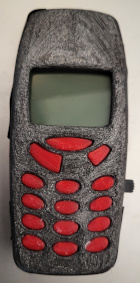
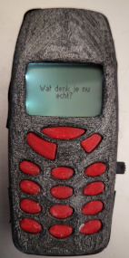
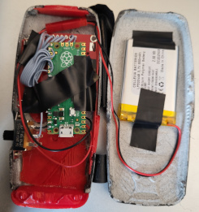

# nokia-lcd

**TL;DR** LARP prop to display messages on a custom Nokia 3310 device

[](images/1.jpg) [](images/2.jpg) [](images/3.jpg)

## Introduction

I enjoy participating in [live action role-playing](https://en.wikipedia.org/wiki/Live_action_role-playing_game), and for my most recent character I decided to create a customized [prop](https://en.wikipedia.org/wiki/Prop) of the iconic [Nokia 3310](https://en.wikipedia.org/wiki/Nokia_3310) cell phone. They seem to be extremely expensive when trying to get ahold of them second-hand, so I decided to 3D print a case and put some electronics in there to control the display.

## Background

This prop was created for a conspiracy theorist who is extremely paranoid of *any* technology. To this goal, he uses an old-fashioned phone that cannot spy on you (or so he believes).

The phone will come to life at random intervals, display some static, display a random message/image, flash the backlight and go back to sleep for a random period of time.

## Hardware

- Raspberry Pico
- Nokia 5510/3310 monochrome LCD display (I got mine at [Tinytronics](https://www.tinytronics.nl/shop/nl/displays/lcd/nokia-5110-lcd-display-rood), also available from [Adafruit](https://www.adafruit.com/product/338))

## Case

I found a STL model at [Thingiverse](https://www.thingiverse.com/thing:4732411) by [Digga79](https://www.thingiverse.com/digga79/designs). It turned out to be very problematic to print due to the necessity for supports. I decided to print the case front and back, sand-paper it and spray-paint it black to hide the obvious 3D printing flaws.

## Wiring

|Raspberry Pico|Display Pin|Display description|
|--------------|-----------|-------------------|
|GP21 (I2C0 SCL)|5|(D/C)|
|GP20 (I2C0 SDA)|4|Reset (RST)|
|GP19 (SPI0 TX)|6|(DN (MOSI))|
|GP18 (SPI0 SCK)|7|(SCLK)|
|GP17 (SPI0 CSn)|3|(SCE)|
|GP16|8|Backlight (LED)|
|+|1|VCC|
|-|2|GND|

Additionally, I wired a [3.7V Li-Po rechargable battery](https://www.tinytronics.nl/shop/nl/power/batterijen/li-po/li-po-accu-3.7v-800mah) with a [switch](https://www.tinytronics.nl/shop/nl/schakelaars/manuele-schakelaars/schuifschakelaars/inbouw-schakelaar-on-off-ss22g08) between pins VSYS and GND.

A [Seeed Studio Lipo Rider Plus](https://www.tinytronics.nl/shop/nl/power/bms-en-laders/li-ion-en-li-po/zonder-protectiecircuit/seeed-studio-lipo-rider-plus) is used for charging (offline, not in the device)

## Flashing the Pico

Hold the BOOTSEL button on the Pico, connect an USB cable to your Linux system and invoke the following command:

```
sudo picotool load build/src/nokia-lcd/nokia_lcd.uf2
```

## Credits

- [Nokia 3310 font by Přemysl Eric Janouch](https://git.janouch.name/p/nokia-3310-fonts), license: ISC
- Eye image created by [Vectorportal](https://commons.wikimedia.org/wiki/File:Eye-vector-vectorportal.svg), license: CC BY-SA 3.0